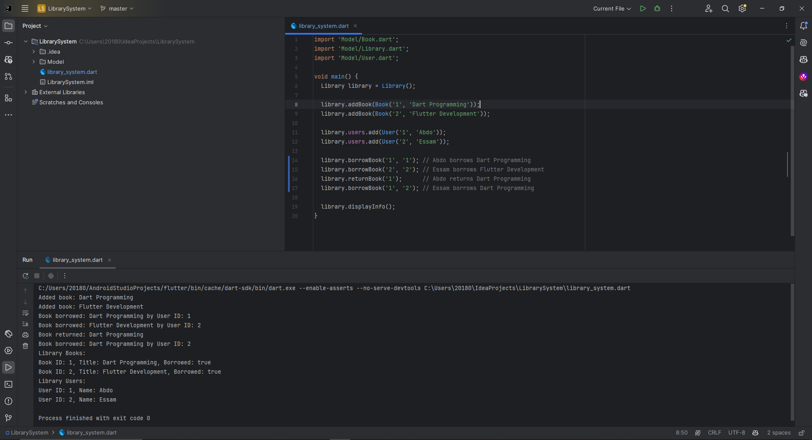

# Dart Library System

This Dart program implements a simple library system to manage borrowed and returned books.

## How to Run

1. Ensure you have Dart installed on your machine.
2. Clone the repository.
3. Navigate to the project directory.
4. Run the program using the command: `dart library_system.dart`

## Code Explanation

- `Book`: Represents a book with attributes `id`, `title`, and `borrowed`.
- `User`: Represents a library user with attributes `id` and `name`.
- `Library`: Manages books and users, with methods to add, borrow, return books, and display information.
- The `main` function demonstrates adding books and users, performing operations, and displaying the final state.

## Output

